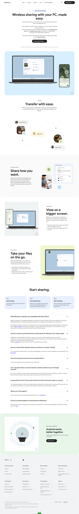

#  Android Quick Share (Download for Windows) Clone

A responsive frontend clone of the official Android Quick Share for Windows landing page.  
Built using HTML, CSS, and Vanilla JavaScript.

---

## 📸 Preview

### 🌐 Original Site


🔗 Official reference: https://www.android.com/better-together/quick-share-app/

---

### 🧪 My Clone


🔗 Live Demo: https://abdughafur.github.io/QuickShare-Clone/

---

## 🕒 Project Info

- **Cloned on:** 20 June 2026
- **Author:** Abdughafur Khujzoda
- **Purpose:** Practice frontend UI cloning and layout skills

---

## ⚙️ Tech Stack

- HTML5
- CSS3 (Flexbox + Grid)
- JavaScript (DOM manipulation + video autoplay control)
- SVG graphics
- MP4 video assets

---

## ✨ Features

- Responsive landing page design
- Hero section with auto-playing videos
- FAQ accordion using `<details>` and `<summary>`
- Smooth layout structure
- Pixel-level UI cloning of Google Android page

---
## 🧠 What I Learned

- Building complex landing page layouts
- Working with video autoplay restrictions in browsers
- Structuring large HTML projects cleanly
- Using SVG icons and embedded media effectively
- Improving UI consistency and spacing accuracy

---

## 🚀 Run Locally

```bash
git clone https://github.com/your-username/quick-share-clone.git
cd quick-share-clone
open index.html
